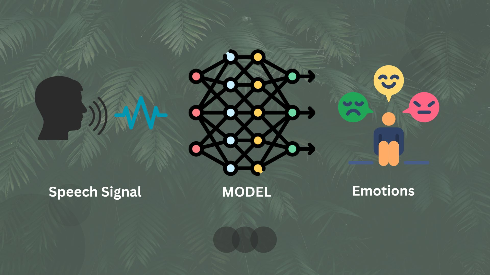

<style>
body {
text-align: justify}
</style>

```{r setup, include=FALSE}
# clear-up the environment
rm(list = ls())

# chunk options
knitr::opts_chunk$set(
  message = FALSE,
  warning = FALSE,
  fig.align = "center",
  comment = "#>"
)

```


```{r, out.width = "100%", echo = FALSE, fig.align = "center"}

```

# Summary


```{r}
# bibliography: references.bib
# link-ci6tations: true
# zotero: "Reproducible Research Series (Year 1)"
```

***

# Preface

## Background
Communication is defined as the process of understanding and sharing meaning (Pearson & Nelson, 2000). In the certain business area, communication is a way to understand the interlocutor as well as customers, potential customers, conversation partner, vendor, etc. Especially in market research at marketing department, the company must be able to gather valuable information from customers as much as possible so that the company can grow exponentially by understanding the customers or potential customers needs & wants.  

The company uses Value Preposition Canvas (VPC) framework to conduct product development so that the company can generate a new product which represent the customer's needs. This framework helps companies or entrepreneurs to solve problems and satisfy the needs of the customer by discovering the customer's pain through identifying the customer's jobs that need to be done. Therefore, to make a customer's job list the company requires to conduct qualitative research or quantitative research.   

Using the company's resources and capabilities, the valuable informations can be used to conduct market research, campaign analysis, product development, process improvement, service improvement, customer satisfaction, product evaluation, service evaluation, customer behavior and so on. 

***

## Business Issue Exploration
There are several informations that company can obtain or gather ranging from needs, wants, complain, review, feed back towards product, response towards new campaign, customer sentiment, etc. Mostly the company's data is taken from questionnaires, observation, interview, social media. Hence, there are two type of datas which taken from survey namely audio data and text data. 

But the problem is the results of data collection is subjective or dishonest answer due to conflict of interest towards brand or surveyor. And it will impact to the company's ability to conduct market research also ability to understand the customers very well. Therefore, it will lead to misleading information, higher customer churn rate, miss communication, bad customer experience, and so on.

***

## Project Idea
In order to minimize misleading information when the company is conducting market research, hence this project develops a classification model which can classify the emotion of a person towards a product, a service, or specific campaign. And the emotions that model classify is anger, happy, neutral, sad.  

***

## Problem Scope
This project only processes the audio data set to classify human emotions. This project uses CREMA-D data set which is taken from https://github.com/CheyneyComputerScience/CREMA-D . CREMA-D is a data set of 7,442 original clips from 91 actors. These clips were from 48 male and 43 female actors between the ages of 20 and 74 coming from a variety of races and ethnicities (African America, Asian, Caucasian, Hispanic, and Unspecified). Actors spoke from a selection of 12 sentences. The sentences were presented using one of six different emotions (Anger, Disgust, Fear, Happy, Neutral, and Sad) and four different emotion levels (Low, Medium, High, and Unspecified). But, in order to make a prototype with the limited resources this project only proceed with four human emotions as target class and with small number of clips (1183 clips).

The data set is an accordance with business need for this project due to:

- The data set represents the diversity of human emotions.
- The size of data set has a sufficiently large number of samples.
- The data set of CREMA-D and Tess come up with metadata that provides additional information about expressed emotions, speaker identities, gender, and other relevant information for emotional speech recognition project.
- These data sets also include variations in language and pronunciation accents, which can be valuable in building a more robust model in recognizing emotional speech from diverse linguistic backgrounds.


***

## Desired Output 
The project output is a dashboard with classification model that can classify several emotions ranging from anger, happiness, sadness, and neutral in real time. 


***

## Business Impact
Therefore, by building emotion speech recognition project can help the company to grow, as follows:

- In marketing and market research departments, emotional speech recognition can be used to analyze customer sentiments, feelings, and emotional responses. This model helps companies understand how customers emotionally respond towards a product, a service, or specific campaign and make decisions based on the analysis. The company can gather customer voice data through various channels, such as recorded customer service calls, one-on-one customer interview, focus group discussion recording, or voice recordings uploaded by customers in the form of testimonials or product reviews in social media.
 
- In the customer service department, emotional speech recognition can be used to understand the emotions and feelings of customers during interactions with customer service agents. As a result, companies can respond better and provide appropriate solutions to enhance customer satisfaction, customer experience, and customer loyalty with strategic communication improvement.

- In the Human Resources department, emotional speech recognition can be used to monitor and analyze employees’ emotional expressions during meetings, presentations, or team interactions. This information can help managers or HR teams to understand employees’ satisfaction levels, anxiety, or happiness so that the HR teams can take appropriate actions to improve their well-being.

- In the recruitment and job interviews, emotional speech recognition can assist companies in analyzing the speech and emotional responses of candidates during job interviews. And, it can provide additional insights into their personality, interpersonal skills, and cultural fit with the company.

- In employee training and development, emotional speech recognition can be used to provide real-time feedback and evaluation on how employees communicate emotionally. This can help to improve communication skills, emotional management, and interpersonal interactions, human resources / outsourcing.

This project can be implemented in various industries as well as telecommunication, internet provider, banking or fintech, home & household appliance, customer service, human resources / outsourcing, travel & hotels, training & education, call center, etc.

***

# Library
```{python}

# base library
import json
import os
import math

# exploratory data
import pandas as pd
import numpy as np
from collections import Counter
# %matplotlib inline
import matplotlib.pyplot as plt
import librosa
import librosa.display
```


***

# Audio Data Preprocessing

## Read & Extracting Data {.tabset}

### Anger Audio
```{python}
FIG_SIZE_L = (10,15)
PATH_L = "data_input/"
files =  ["1001_IEO_ANG_HI.wav", "1088_IEO_ANG_LO.wav", "1018_IEO_ANG_MD.wav", "1019_MTI_ANG_XX.wav"]

for item in files:
    FILE_PATH_L = PATH_L + item
    # load audio file with Librosa
    signal, sample_rate = librosa.load(FILE_PATH_L, sr=44100)
    
    # display waveform
    plt.figure(figsize=(12, 4))
    librosa.display.waveshow(signal, sr=sample_rate, alpha=0.4)
    plt.xlabel("Time (s)")
    plt.ylabel("Amplitude")
    plt.yticks(np.arange(-1, 1.25, 0.5))
    plt.title(f"Waveform ({'_'.join(item.split(sep='_')[2:4]).replace('.wav','')})")
    plt.show()
```

***

### Happiness Audio
```{python}
FIG_SIZE_H = (10,15)
PATH_H = "data_input/"
files_H =  ["1090_IEO_HAP_HI.wav", "1065_IEO_HAP_LO.wav", "1044_IEO_HAP_MD.wav", "1029_IWL_HAP_XX.wav"]

for item in files_H:
    FILE_PATH_H = PATH_H + item
    # load audio file with Librosa
    signal, sample_rate = librosa.load(FILE_PATH_H, sr=44100)
    
    # display waveform
    plt.figure(figsize=(12, 4))
    librosa.display.waveshow(signal, sr=sample_rate, alpha=0.4)
    plt.xlabel("Time (s)")
    plt.ylabel("Amplitude")
    plt.yticks(np.arange(-1, 1.25, 0.5))
    plt.title(f"Waveform ({'_'.join(item.split(sep='_')[2:4]).replace('.wav','')})")
    plt.show()
```


***

### Sadness Audio
```{python}
FIG_SIZE_S = (10,15)
PATH_S = "data_input/"
files_S =  ["1054_IEO_SAD_HI.wav", "1055_IEO_SAD_LO.wav", "1043_IEO_SAD_MD.wav", "1035_IOM_SAD_XX.wav"]

for item in files_S:
    FILE_PATH_S = PATH_S + item
    # load audio file with Librosa
    signal, sample_rate = librosa.load(FILE_PATH_S, sr=44100)
    
    # display waveform
    plt.figure(figsize=(12, 4))
    librosa.display.waveshow(signal, sr=sample_rate, alpha=0.4)
    plt.xlabel("Time (s)")
    plt.ylabel("Amplitude")
    plt.yticks(np.arange(-1, 1.25, 0.5))
    plt.title(f"Waveform ({'_'.join(item.split(sep='_')[2:4]).replace('.wav','')})")
    plt.show()
```


***

### Neutral Audio
```{python}
FIG_SIZE_N = (10,15)
PATH_N = "data_input/"
files_N =  ["1091_IWW_NEU_XX.wav", "1050_IWW_NEU_XX.wav", "1017_IWW_NEU_XX.wav", "1001_IWW_NEU_XX.wav"]

for item in files_N:
    FILE_PATH_N = PATH_N + item
    # load audio file with Librosa
    signal, sample_rate = librosa.load(FILE_PATH_N, sr=44100)
    
    # display waveform
    plt.figure(figsize=(12, 4))
    librosa.display.waveshow(signal, sr=sample_rate, alpha=0.4)
    plt.xlabel("Time (s)")
    plt.ylabel("Amplitude")
    plt.yticks(np.arange(-1, 1.25, 0.5))
    plt.title(f"Waveform ({'_'.join(item.split(sep='_')[2:4]).replace('.wav','')})")
    plt.show()
```


***

```{python}
# import wave
# # Open wav file and read frames as bytes
# sf_filewave = wave.open('DCC-Emotional_Speech_Recognition\data_input/1001_IEO_ANG_HI.wav', 'r')
# signal_sf = sf_filewave.readframes(-1)
# 
# # Convert audio bytes to integers
# soundwave_sf = np.frombuffer(signal_sf, dtype='int16')
# 
# # Get the sound wave frame rate
# framerate_sf = sf_filewave.getframerate()
# 
# # Find the sound wave timestamps
# time_sf = np.linspace(start=0,
#                       stop=len(soundwave_sf)/framerate_sf,
#                       num=len(soundwave_sf))
#                       
# # Set up plot
# f, ax = plt.subplots(figsize=(15, 3))
# 
# # Setup the title and axis titles
# plt.title('Amplitude over Time')
# plt.ylabel('Amplitude')
# plt.xlabel('Time (seconds)')
# # Add the audio data to the plot
# ax[0] = plt.plot(time_sf, soundwave_sf, label='Warm Memories', alpha=0.5)
# plt.legend()
# plt.show()
```


***

# EDA


***


```{python}

```


# References

1. Pearson, J., & Nelson, P. (2000). An introduction to human communication: Understanding and sharing (p. 6). Boston, MA: McGraw-Hill. In certain business area, communication 


